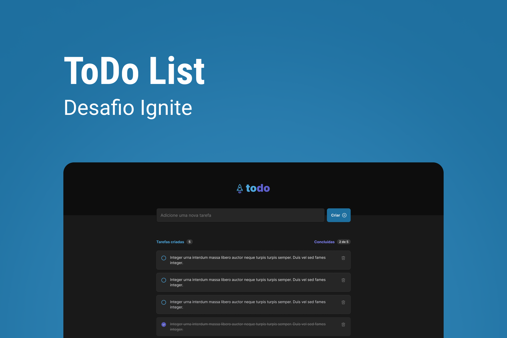

<!-- markdownlint-disable MD033 -->
<!-- markdownlint-disable MD041 -->

<div align="center">
   <a href="https://github.com/mgckaled">
      
   </a>
   
   
   <a href="https://github.com/mgckaled/ignite-react_todo-list/commits/main">
      
   </a>
   
  
</div>

<br>

<div align="center">
  <a>
     
     
     

  <a/>
</div>

<br>

# React - Desafio Todo-List

<div align="center">

[**Sobre o Projeto**](#sobre-o-projeto) &nbsp;&nbsp;**•**&nbsp;&nbsp;
[**Layout**](#layout) &nbsp;&nbsp;**•**&nbsp;&nbsp;
[**Configurações**](#configurações) &nbsp;&nbsp;**•**&nbsp;&nbsp;
[**Texnologias**](#tecnologias) &nbsp;&nbsp;**•**&nbsp;&nbsp;
[**Licença**](#licença)&nbsp;&nbsp;**•**&nbsp;&nbsp;
[**Autor**](#autor)

</div>
<div align="center">
  
</div>

## Sobre o Projeto

Nesse desafio, foi desenvolvido uma aplicação de controle de tarefas no estilo **to-do list**, que contém as seguintes funcionalidades:

- Adicionar uma nova tarefa
- Marcar e desmarcar uma tarefa como concluída
- Remover uma tarefa da listagem
- Mostrar o progresso de conclusão das tarefas

Apesar de serem poucas funcionalidades, foram utilizados conceitos como:

- Estados
- Imutabilidade do estado
- Listas e chaves no ReactJS
- Propriedades
- Componentização

Análises e comentários sobre o código [AQUI](/.github/docs/index.md).

## Layout

O layout das telas da aplicação **ToDo List** foi desenvolvido pela equipe da **Rocketseat** através da ferramenta [**Figma**](https://www.figma.com).
Você pode acessar o layout através deste link: [**ToDo List**](https://www.figma.com/file/Dka8BT8X9glWypErkgm938).

## Configurações

Necessário realizar as seguintes instalações:

- [Git](https://git-scm.com/)
- [npm](https://www.npmjs.com/)
- [Node](https://nodejs.org/)

Criar conta e configurar os serviços externos:

- [GitHub](https://github.com/)

Clonar repositório:

```bash
# Execute o comando git clone para realizar o clone do repositório
$ git clone https://github.com/mgkclaed/ignite-react_todo-list.git
# ou execute
$ gh repo clone mgckaled/ignite-react_todo-list
# Entre na pasta do repositório clonado
$ cd ignite-react_todo-list
```

Dependências e inicialização:

```bash
## instalar dependências
$ npm install
```

Scripts Backend:

```bash
# Rodar servidor em ambiente de desenvolvimento:
$ npm run dev
```

## Tecnologias

- [React](https://pt-br.reactjs.org/)
- [TypeScript](https://www.typescriptlang.org/)
- [Vite](https://vitejs.dev/)

## Licença

Distribuído sob a licença **_MIT_**. Veja [LICENSE](LICENSE) para mais informações.

## Autor

Feito por Marcel Kaled. Entre em contato!

---

<h5 align="center">
  &copy;2023 - <a href="https://github.com/mgckaled/">Marcel Kaled</a>
</h5>
